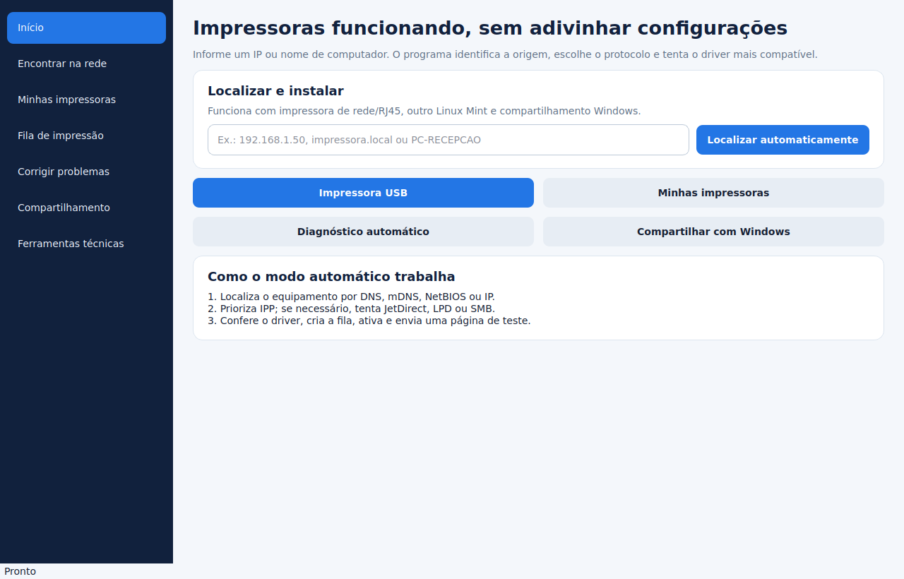

# Neri Printer Manager

Gerenciador de impressoras para Linux Mint com descoberta, instalação,
compartilhamento e diagnóstico em uma interface PySide6. A versão atual é **2.0.0**.

O aplicativo cobre impressoras USB, equipamentos de rede/RJ45 e filas publicadas
por Linux Mint ou Windows. A interface roda como usuário comum; somente as ações
administrativas previamente autorizadas passam por PolicyKit.



## Cenários atendidos

| Origem | Descoberta/conexão | Comportamento |
|---|---|---|
| USB local | Backend USB do CUPS | Identifica fabricante/modelo e prioriza o driver instalado mais compatível |
| Impressora de rede | IP/hostname, IPP/IPPS, JetDirect e LPD | Prioriza IPP e testa alternativas seguras quando necessário |
| Outro Linux Mint | Filas do CUPS remoto | Enumera as filas reais em `ipp://host:631/printers/fila` |
| Windows/Samba | NetBIOS/DNS e SMB autenticado | Consulta os compartilhamentos sem gravar a senha em log |
| Mint compartilhando | CUPS e Samba | Publica apenas a fila escolhida e mantém o acesso Samba autenticado |

Também estão incluídos:

- fila de trabalhos, cancelamento, pausa, retomada, impressora padrão e página de teste;
- central de saúde com correções limitadas, confirmação e nova verificação;
- relatório HTML, pacote ZIP de suporte com logs higienizados e backup com SHA-256;
- CLI para suporte técnico e automação;
- empacotamento `.deb`, ambiente de desenvolvimento e CI para Python 3.10/3.12.

## Instalação no Linux Mint

Se você baixou o pacote Debian, abra o terminal na pasta onde ele foi salvo e
execute:

```bash
sudo apt install ./neri-printer.deb
```

O nome curto facilita a instalação; internamente, o pacote e os comandos
continuam usando `neri-printer-manager`.

Para instalar diretamente pelo repositório, execute no terminal do usuário que
utilizará o programa, sem abrir antes um shell root:

```bash
wget -qO- https://raw.githubusercontent.com/Dexterrpk/neri-printer-manager/main/bootstrap.sh | bash
```

Alternativa com `curl`:

```bash
curl -fsSL https://raw.githubusercontent.com/Dexterrpk/neri-printer-manager/main/bootstrap.sh | bash
```

O bootstrap preserva uma cópia local com alterações ou histórico divergente. Ele
só faz atualização *fast-forward* de uma `main` limpa; nos demais casos usa uma
cópia temporária da versão oficial.

Modos disponíveis:

```bash
# Atualiza reutilizando um ambiente íntegro
wget -qO- https://raw.githubusercontent.com/Dexterrpk/neri-printer-manager/main/bootstrap.sh | bash -s -- --fast

# Reinstala dependências e recria o ambiente
wget -qO- https://raw.githubusercontent.com/Dexterrpk/neri-printer-manager/main/bootstrap.sh | bash -s -- --repair
```

Depois da instalação, abra normalmente como usuário comum:

```bash
neri-printer-manager
neri-printer-cli --version
```

Quando uma operação exigir privilégios administrativos, o próprio aplicativo
solicitará a senha pelo PolicyKit. Para diagnóstico ou suporte técnico, também é
possível iniciar toda a interface como administrador:

```bash
sudo -H neri-printer-manager
```

O modo com `sudo` concede privilégio total à interface e, por isso, deve ser
usado somente quando a execução normal não resolver o problema. A opção `-H`
evita criar arquivos pertencentes ao root na pasta pessoal do usuário.

Para remover uma instalação feita pelo bootstrap, execute
`sudo ./uninstall.sh` dentro do projeto. Se tiver usado o pacote `.deb`, use
`sudo apt remove neri-printer-manager`; as filas e configurações do CUPS são
preservadas nos dois casos.

O instalador não instala `cups-browsed`. Se esse serviço já estiver ativo por
decisão da distribuição, suas filas `implicitclass://` são classificadas como
publicações remotas e não aparecem em **Minhas impressoras**.

## Uso rápido

1. Para rede, digite o IP ou hostname na tela inicial.
2. Para Windows, informe usuário e senha SMB somente quando solicitado.
3. Confira a opção recomendada, escolha um nome local e instale.
4. Para USB, abra **Ferramentas técnicas → USB**.
5. Se algo falhar, abra **Corrigir problemas** e execute o diagnóstico completo.

O [manual do usuário](docs/USER_GUIDE.md) detalha cada fluxo e as limitações.

## Segurança

- Nenhum comando usa `shell=True`.
- Nomes de fila, identificadores de driver, hostnames e URIs são validados duas vezes:
  na aplicação e novamente após a elevação.
- O helper PolicyKit aceita apenas um catálogo fixo de operações, pacotes e serviços.
- A senha SMB segue por entrada padrão e pela API local do CUPS; não entra em
  nenhuma linha de comando.
- Logs e relatórios removem *userinfo*, senhas, tokens e cabeçalhos de autorização.
- O compartilhamento CUPS usa a política de rede local e desativa explicitamente
  acesso irrestrito e administração remota.
- A interface nunca precisa ser executada como root nem concede `lpadmin` ao usuário.

Consulte [SECURITY.md](SECURITY.md) e a
[arquitetura](docs/ARCHITECTURE.md) para a fronteira de privilégio completa.

## Desenvolvimento e validação

```bash
sudo apt install python3-cups
python3 -m venv --system-site-packages .venv
.venv/bin/python -m pip install -e '.[dev]'
QT_QPA_PLATFORM=offscreen .venv/bin/pytest -q
.venv/bin/ruff format --check .
.venv/bin/ruff check .
.venv/bin/mypy src
```

Ou execute tudo com:

```bash
bash scripts/validate.sh
```

Para gerar o pacote Debian:

```bash
bash scripts/build_deb.sh
```

O artefato é criado em `build/` com a versão do `pyproject.toml` e a
arquitetura informada por `dpkg`.

## Estado de liberação

Os testes automatizados cobrem validação, descoberta, seleção de protocolo,
instalação, higienização e fronteira administrativa. A confirmação final de
impressão exige hardware real, driver compatível e as políticas da rede/servidor.
A matriz obrigatória está em [docs/HOMOLOGATION.md](docs/HOMOLOGATION.md).

## Documentação

- [Manual do usuário](docs/USER_GUIDE.md)
- [Arquitetura e fluxo de dados](docs/ARCHITECTURE.md)
- [Solução de problemas](docs/TROUBLESHOOTING.md)
- [Homologação em hardware real](docs/HOMOLOGATION.md)
- [Histórico de mudanças](CHANGELOG.md)

Licenciado sob a [MIT License](LICENSE).
