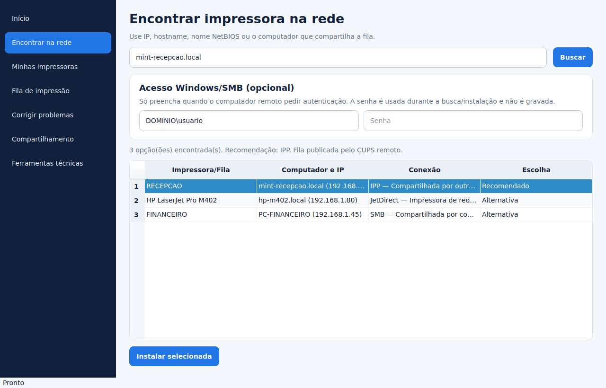
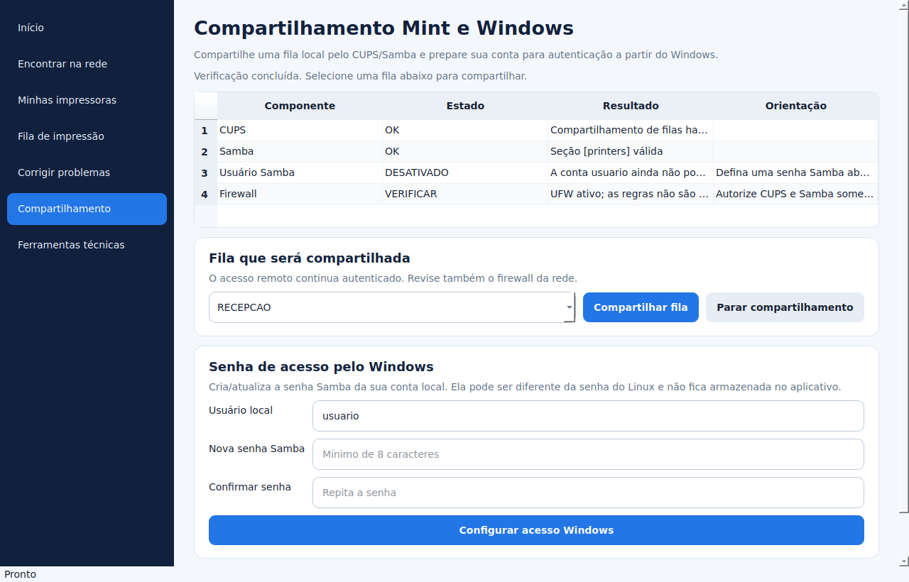

# Manual do usuário

## Antes de começar

Use o Neri Printer Manager como usuário comum. Quando uma mudança administrativa
for necessária, o PolicyKit pedirá a credencial de uma conta administradora.
Mantenha a impressora ligada e, para rede, conectada ao mesmo segmento ou a uma
rota permitida pelo firewall.

## Tela inicial

Digite um IP ou hostname e clique em **Localizar automaticamente**. O aplicativo:

1. resolve DNS, mDNS, `getent` ou NetBIOS;
2. verifica apenas as portas conhecidas de impressão;
3. enumera filas CUPS e SMB quando o host for um computador;
4. ordena IPP, JetDirect, LPD e SMB por compatibilidade;
5. testa driverless e depois os drivers locais mais aderentes.

Uma fila existente nunca é substituída silenciosamente. Escolha outro nome ou
remova a fila antiga conscientemente.

## Impressora de rede ou RJ45

1. Localize pelo IP/hostname.
2. Selecione a opção marcada como recomendada.
3. Escolha o nome local.
4. Autorize a criação da fila.
5. Confira a página de teste física.

IPP é priorizado. Se o equipamento anunciar IPP mas não implementar os atributos
necessários, o instalador testa o driver exato, PostScript/PCL e transportes
compatíveis sem alterar outra fila.

## Outro Linux Mint

Informe o IP ou hostname do Mint remoto. Quando a porta 631 responder, o programa
consulta os nomes reais publicados pelo CUPS remoto. Escolha a fila desejada; não
é usado um caminho `/ipp/print` inventado para o computador inteiro.

No Mint que compartilha, use **Compartilhamento**, selecione a fila local e clique
em **Compartilhar fila**. A política padrão restringe o CUPS à rede local.

## Windows/SMB

1. Informe o IP, hostname ou `\\SERVIDOR`.
2. Preencha o usuário como `usuario`, `DOMINIO\\usuario` ou `PC\\usuario`.
3. Digite a senha e pesquise.
4. Selecione o compartilhamento com tipo **SMB** e instale.

A senha some do campo assim que a pesquisa começa. Ela não é gravada no log nem
vai como argumento do processo administrativo.

Para permitir que um Windows use uma impressora deste Mint:

1. abra **Compartilhamento**;
2. selecione e compartilhe uma fila;
3. configure uma senha Samba para a conta local atual;
4. no Windows, conecte usando o hostname/IP do Mint e essa conta;
5. se necessário, autorize as portas 139/445 somente na rede local.

## USB

Abra **Ferramentas técnicas → USB**, clique em **Procurar USB**, confira o modelo
e instale. O modo `everywhere` não é forçado em USB; o driver específico ou um PPD
genérico compatível é priorizado.

## Minhas impressoras e trabalhos

Em **Minhas impressoras** é possível definir padrão, testar, pausar, retomar,
compartilhar ou remover a fila local. A remoção não apaga configurações do
equipamento remoto.

Em **Fila de impressão**, selecione um trabalho para cancelá-lo. O cancelamento de
todos os trabalhos só aparece como correção confirmada na central de saúde.

## Diagnóstico e correção

**Corrigir automaticamente** executa apenas itens marcados como seguros, como
ativar CUPS/Avahi ou reinstalar um componente obrigatório confirmado. Endereço,
credencial e driver específico sempre exigem decisão humana.

Depois de cada correção, o diagnóstico é repetido. Uma mensagem sobre erro antigo
do log pede uma nova página de teste em vez de alegar que o defeito atual persiste.

## Relatório, suporte e backup

- **Relatório HTML:** estado atual em formato legível.
- **Pacote de suporte ZIP:** relatórios e até 2.500 linhas recentes de cada log,
  com credenciais removidas.
- **Backup completo:** configuração CUPS, PPDs e Samba, quando presentes, mais
  manifesto e SHA-256.

O backup pode conter configuração protegida do CUPS. Guarde-o como um arquivo
confidencial. A versão 2.0 cria backup, mas não restaura automaticamente: a
restauração deve ser revisada por um administrador para não sobrescrever um
servidor de impressão em produção.
